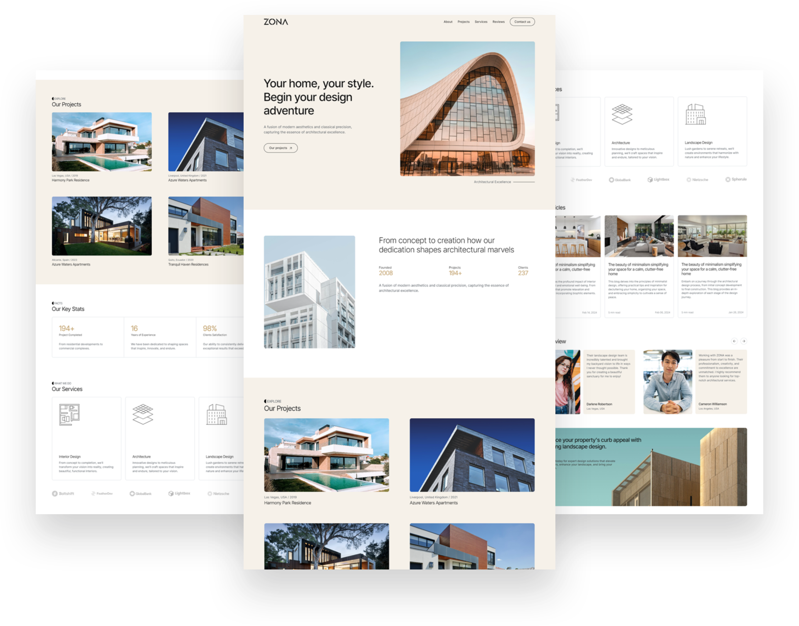

<h1 align="center">ZONA - Architecture company</h1>

## Overview

This project is an innovative architectural portfolio website developed for ZONA, a leading architecture firm dedicated to shaping the skylines of tomorrow. The website showcases a curated selection of their most inspiring projects, demonstrating their commitment to creativity, functionality, and sustainability.

## Features

- **Portfolio Showcase:** Explore a diverse range of architectural projects, each highlighting the unique design philosophy and expertise.
- **History:** Learn about the rich history of ZONA, from its establishment in 2008 to its evolution as a trusted name in the industry.
- **Services:** Discover the comprehensive range of architectural services offered by [Company Name], tailored to meet the diverse needs of our clients.
